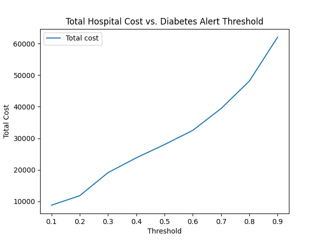
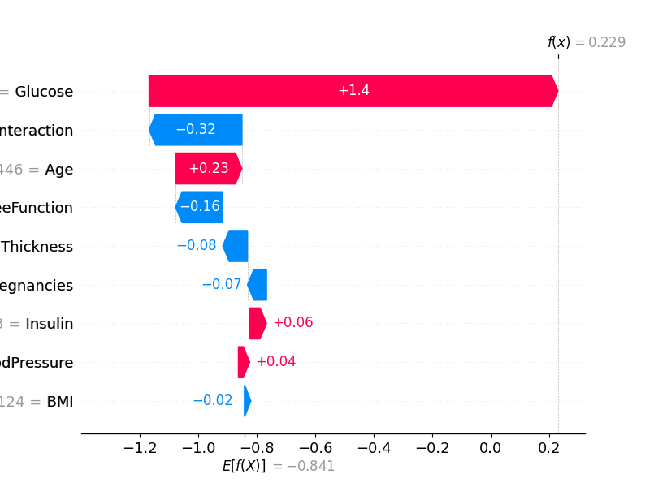
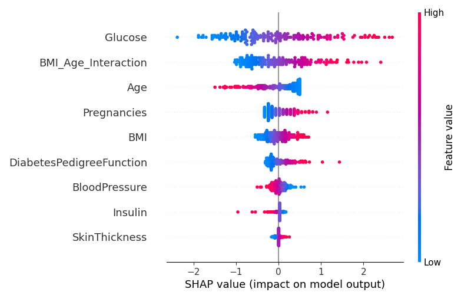

**Diabetes Risk Prediction **

## Overview

This project implements a cost-sensitive clinical decision support system to identify patients at elevated risk of diabetes using early health indicators such as glucose, insulin, BMI, and age.

A logistic regression model is trained to estimate diabetes risk probabilities, while decision thresholds are optimized to minimize hospital costs and reduce false negatives. The system emphasizes interpretability through model coefficients and SHAP explanations, enabling clinicians to understand both population-level trends and individual patient predictions.

## Problem Framing & Objective

In a clinical setting, diabetes screening models must balance predictive accuracy with real-world cost considerations. False negatives (missed high-risk patients) can lead to delayed treatment and significantly higher downstream healthcare costs, while excessive false positives can overburden hospital resources.

The objective of this project is not only to predict diabetes risk, but to optimize alerting decisions under cost constraints. Instead of using a fixed probability threshold, the system evaluates multiple thresholds and selects operating points that reduce total hospital cost while prioritizing early detection of high-risk patients.

## ML Pipeline Overview

The system follows a modular machine learning pipeline designed to support experimentation, interpretability, and cost-aware decision-making:

1. **Data Loading & Cleaning**  
   Raw patient data is loaded from CSV files and cleaned to handle missing values and inconsistent entries.

2. **Feature Engineering**  
   Clinical features such as glucose, insulin, BMI, age, and skin thickness are standardized and prepared for modeling.

3. **Model Training**  
   A logistic regression model is trained to produce calibrated probability estimates for diabetes risk rather than hard class labels.

4. **Evaluation & Threshold Analysis**  
   Model outputs are evaluated across a range of decision thresholds to analyze tradeoffs between false positives, false negatives, and total hospital cost.

5. **Interpretability & Visualization**  
   Model behavior is analyzed using coefficient inspection and SHAP explanations to provide both global and per-patient insight into predictions.

## Model & Decision Logic

The system uses logistic regression to model diabetes risk as a probability rather than a binary outcome. This choice provides a transparent, well-calibrated baseline model that supports downstream decision-making and interpretability.

Instead of applying a fixed classification threshold, predicted probabilities are evaluated across a range of alert thresholds. For each threshold, the system computes downstream outcomes such as false positives, false negatives, and total estimated hospital cost.

Final alert decisions are made by selecting thresholds that balance early detection with operational cost constraints, allowing the same trained model to support different sensitivity levels without retraining.

## Interpretability & Clinical Explainability

Model interpretability is a core design requirement of the system. Predictions are explained at both the population level and the individual patient level to support clinical review and trust.

- **Global Interpretability**  
  Logistic regression coefficients and SHAP summary plots are used to identify which clinical features (e.g., glucose, BMI, age) have the greatest overall influence on diabetes risk predictions.

- **Local Interpretability**  
  SHAP waterfall plots are generated for individual patients to explain why a specific risk score was assigned and which features contributed most to that prediction.

These explanations allow clinicians to validate model behavior, understand decision rationale, and assess whether flagged alerts align with clinical intuition.

## Cost-Sensitive Threshold Optimization

To translate risk probabilities into actionable alerts, the system evaluates decision thresholds under a cost-sensitive framework. Each threshold is analyzed based on its impact on false positives, false negatives, and total estimated hospital cost.

Cost curves are generated to visualize how total cost varies as a function of the alert threshold. This enables selection of operating points that prioritize early detection while avoiding excessive alert volume.

By decoupling model training from decision threshold selection, the system allows clinical teams to adjust sensitivity levels without retraining the underlying model.

## Outputs & Artifacts

For each run, the system generates structured outputs intended to support both clinical review and downstream analysis:

- **Risk Scores & Alerts (CSV)**  
  A tabular report containing patient-level risk probabilities, alert flags, and contributing features.

- **Cost Curve Plots**  
  Line plots showing total estimated hospital cost across decision thresholds, used to select optimal operating points.

- **Interpretability Visualizations**  
  - SHAP summary plots highlighting globally important clinical features  
  - SHAP waterfall plots explaining individual patient predictions  
  - Model coefficient tables showing feature influence direction and magnitude

- **Evaluation Metrics**  
  Precision, recall, confusion matrices, and threshold-specific outcome summaries.

Representative examples of these outputs are shown below; all plots are generated automatically during execution.

### Cost vs Threshold Tradeoff

### Global Feature Importance (SHAP)

### Individual Prediction Explanation

